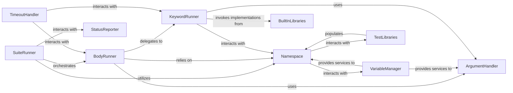

## Component Details

One paragraph explaining the functionality which is represented by this graph. What the main flow is and what is its purpose.

### SuiteRunner

The top-level orchestrator for running test suites. It manages the overall execution lifecycle of a suite, including setup, teardown, and the sequential execution of its test cases and child suites. It delegates the actual execution of test bodies and keywords to other components.

**Related Classes/Methods**:

- <a href="https://github.com/robotframework/robotframework/blob/master/src/robot/running/suiterunner.py#L35-L298" target="_blank" rel="noopener noreferrer">`robot.running.suiterunner.SuiteRunner` (35:298)</a>

### BodyRunner

Responsible for executing the "body" of a test case or a keyword, which consists of a sequence of other keywords. It iterates through these keywords, handles their execution, and manages their individual status and potential failures.

**Related Classes/Methods**:

- <a href="https://github.com/robotframework/robotframework/blob/master/src/robot/running/bodyrunner.py#L39-L72" target="_blank" rel="noopener noreferrer">`robot.running.bodyrunner.BodyRunner` (39:72)</a>

### Namespace

Manages the dynamic execution context. This includes tracking the current variable scopes (global, suite, test, local), providing access to imported libraries, and resolving keywords. It acts as a central registry for runtime information, enabling dynamic keyword resolution and variable access.

**Related Classes/Methods**:

- <a href="https://github.com/robotframework/robotframework/blob/master/src/robot/running/namespace.py#L33-L228" target="_blank" rel="noopener noreferrer">`robot.running.namespace.Namespace` (33:228)</a>

### VariableManager

A comprehensive system for handling all aspects of variables during test execution. This includes managing variable scopes, replacing variables in strings, and searching for variable values. It ensures dynamic data handling and resolution within tests.

**Related Classes/Methods**:

- <a href="https://github.com/robotframework/robotframework/blob/master/src/robot/variables/scopes.py#L0-L0" target="_blank" rel="noopener noreferrer">`robot.variables.scopes` (0:0)</a>

- <a href="https://github.com/robotframework/robotframework/blob/master/src/robot/variables/replacer.py#L0-L0" target="_blank" rel="noopener noreferrer">`robot.variables.replacer` (0:0)</a>

- <a href="https://github.com/robotframework/robotframework/blob/master/src/robot/variables/search.py#L0-L0" target="_blank" rel="noopener noreferrer">`robot.variables.search` (0:0)</a>

- <a href="https://github.com/robotframework/robotframework/blob/master/src/robot/variables/store.py#L0-L0" target="_blank" rel="noopener noreferrer">`robot.variables.store` (0:0)</a>

- <a href="https://github.com/robotframework/robotframework/blob/master/src/robot/variables/finders.py#L0-L0" target="_blank" rel="noopener noreferrer">`robot.variables.finders` (0:0)</a>

- <a href="https://github.com/robotframework/robotframework/blob/master/src/robot/variables/evaluation.py#L0-L0" target="_blank" rel="noopener noreferrer">`robot.variables.evaluation` (0:0)</a>

### ArgumentHandler

Responsible for parsing, resolving, converting, and validating arguments passed to keywords. It handles different argument types, default values, and type conversions to ensure keywords receive arguments in the correct format, supporting robust keyword invocation.

**Related Classes/Methods**:

- <a href="https://github.com/robotframework/robotframework/blob/master/src/robot/running/arguments/argumentparser.py#L0-L0" target="_blank" rel="noopener noreferrer">`robot.running.arguments.argumentparser` (0:0)</a>

- <a href="https://github.com/robotframework/robotframework/blob/master/src/robot/running/arguments/argumentresolver.py#L0-L0" target="_blank" rel="noopener noreferrer">`robot.running.arguments.argumentresolver` (0:0)</a>

- <a href="https://github.com/robotframework/robotframework/blob/master/src/robot/running/arguments/argumentconverter.py#L0-L0" target="_blank" rel="noopener noreferrer">`robot.running.arguments.argumentconverter` (0:0)</a>

- <a href="https://github.com/robotframework/robotframework/blob/master/src/robot/running/arguments/argumentvalidator.py#L0-L0" target="_blank" rel="noopener noreferrer">`robot.running.arguments.argumentvalidator` (0:0)</a>

- <a href="https://github.com/robotframework/robotframework/blob/master/src/robot/running/arguments/typeconverters.py#L0-L0" target="_blank" rel="noopener noreferrer">`robot.running.arguments.typeconverters` (0:0)</a>

### KeywordRunner

Represents the mechanism for dispatching and executing individual keywords. This component determines whether a keyword is a user-defined keyword or a library keyword and delegates to the appropriate concrete runner (`UserKeywordRunner` or `LibraryKeywordRunner`).

**Related Classes/Methods**:

- `robot.running.keywordrunner.UserKeywordRunner` (0:0)

- `robot.running.keywordrunner.LibraryKeywordRunner` (0:0)

- <a href="https://github.com/robotframework/robotframework/blob/master/src/robot/running/keywordimplementation.py#L0-L0" target="_blank" rel="noopener noreferrer">`robot.running.keywordimplementation` (0:0)</a>

### TestLibraries

Manages the loading, importing, and access to test libraries (both built-in and external). It ensures that library keywords are available for execution and handles dynamic library loading and keyword discovery.

**Related Classes/Methods**:

- <a href="https://github.com/robotframework/robotframework/blob/master/src/robot/running/testlibraries.py#L0-L0" target="_blank" rel="noopener noreferrer">`robot.running.testlibraries.TestLibraries` (0:0)</a>

- <a href="https://github.com/robotframework/robotframework/blob/master/src/robot/running/testlibraries.py#L0-L0" target="_blank" rel="noopener noreferrer">`robot.running.testlibraries.Importer` (0:0)</a>

### BuiltInLibraries

Provides a collection of fundamental keywords that are always available in Robot Framework. These libraries perform common operations like logging, variable manipulation, and flow control, forming the basic building blocks for tests.

**Related Classes/Methods**:

- <a href="https://github.com/robotframework/robotframework/blob/master/src/robot/libraries/BuiltIn.py#L4091-L4369" target="_blank" rel="noopener noreferrer">`robot.libraries.BuiltIn` (4091:4369)</a>

- <a href="https://github.com/robotframework/robotframework/blob/master/src/robot/libraries/Collections.py#L987-L1261" target="_blank" rel="noopener noreferrer">`robot.libraries.Collections` (987:1261)</a>

- <a href="https://github.com/robotframework/robotframework/blob/master/src/robot/libraries/OperatingSystem.py#L39-L1449" target="_blank" rel="noopener noreferrer">`robot.libraries.OperatingSystem` (39:1449)</a>

- <a href="https://github.com/robotframework/robotframework/blob/master/src/robot/libraries/Process.py#L35-L906" target="_blank" rel="noopener noreferrer">`robot.libraries.Process` (35:906)</a>

- <a href="https://github.com/robotframework/robotframework/blob/master/src/robot/libraries/XML.py#L45-L1458" target="_blank" rel="noopener noreferrer">`robot.libraries.XML` (45:1458)</a>

### StatusReporter

Tracks and reports the real-time status and outcomes of test execution steps, including suites, tests, and keywords. It provides updates to listeners and other output components, ensuring that the progress and results of the execution are communicated.

**Related Classes/Methods**:

- <a href="https://github.com/robotframework/robotframework/blob/master/src/robot/running/statusreporter.py#L24-L105" target="_blank" rel="noopener noreferrer">`robot.running.statusreporter.StatusReporter` (24:105)</a>

- <a href="https://github.com/robotframework/robotframework/blob/master/src/robot/running/status.py#L0-L0" target="_blank" rel="noopener noreferrer">`robot.running.status` (0:0)</a>

### TimeoutHandler

Manages and enforces timeouts for test cases and keywords, ensuring that execution does not exceed predefined time limits and preventing tests from hanging indefinitely.

**Related Classes/Methods**:

- `robot.running.timeout.Timeout` (0:0)

- `robot.running.timeout.Runner` (0:0)

### [FAQ](https://github.com/CodeBoarding/GeneratedOnBoardings/tree/main?tab=readme-ov-file#faq)