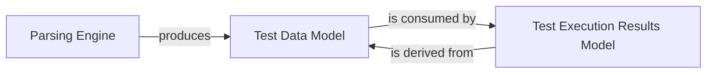

## Component Details

The `Test Data Management` component is fundamental to Robot Framework, serving as the central hub for representing and processing all test-related information. It is comprised of three core sub-components: the `Parsing Engine`, the `Test Data Model`, and the `Test Execution Results Model`. These components work in concert to transform raw test specifications into executable structures and, subsequently, to capture and store the outcomes of test runs.

### Parsing Engine

This component is the initial entry point for test data. It is responsible for reading raw Robot Framework test files (e.g., `.robot`, `.resource`) and converting their content into a structured, in-memory representation. This process involves lexical analysis (tokenizing the input) and syntactic analysis (building the hierarchical test suite structure). It acts as the bridge between the plain text test definitions and the internal object model.

**Related Classes/Methods**:

- <a href="https://github.com/robotframework/robotframework/blob/master/src/robot/parsing/parser/parser.py#L26-L59" target="_blank" rel="noopener noreferrer">`src.robot.parsing.parser.parser:get_model` (26:59)</a>

- <a href="https://github.com/robotframework/robotframework/blob/master/src/robot/parsing/lexer/lexer.py#L96-L208" target="_blank" rel="noopener noreferrer">`src.robot.parsing.lexer.lexer.Lexer` (96:208)</a>

- <a href="https://github.com/robotframework/robotframework/blob/master/src/robot/parsing/suitestructure.py#L115-L185" target="_blank" rel="noopener noreferrer">`src.robot.parsing.suitestructure.SuiteStructureBuilder` (115:185)</a>

### Test Data Model

This component defines the canonical in-memory object model for representing Robot Framework test specifications *before* execution. It provides a structured, programmatic interface to test suites, individual test cases, and keywords, including their settings, arguments, and body content. This model is the direct output of the `Parsing Engine` and serves as the input for the test execution phase.

**Related Classes/Methods**:

- <a href="https://github.com/robotframework/robotframework/blob/master/src/robot/model/testsuite.py#L38-L482" target="_blank" rel="noopener noreferrer">`src.robot.model.testsuite.TestSuite` (38:482)</a>

- <a href="https://github.com/robotframework/robotframework/blob/master/src/robot/model/testcase.py#L36-L218" target="_blank" rel="noopener noreferrer">`src.robot.model.testcase.TestCase` (36:218)</a>

- <a href="https://github.com/robotframework/robotframework/blob/master/src/robot/model/keyword.py#L25-L73" target="_blank" rel="noopener noreferrer">`src.robot.model.keyword.Keyword` (25:73)</a>

### Test Execution Results Model

This component extends the `Test Data Model` by incorporating execution-specific information. It defines the data structures used to store the detailed outcomes of a test run, including execution status (pass/fail), error messages, timestamps, and statistics for suites, test cases, and keywords. This model is populated during test execution and is crucial for generating reports and logs.

**Related Classes/Methods**:

- <a href="https://github.com/robotframework/robotframework/blob/master/src/robot/result/model.py#L1051-L1317" target="_blank" rel="noopener noreferrer">`src.robot.result.model.TestSuite` (1051:1317)</a>

- <a href="https://github.com/robotframework/robotframework/blob/master/src/robot/result/model.py#L1002-L1048" target="_blank" rel="noopener noreferrer">`src.robot.result.model.TestCase` (1002:1048)</a>

- <a href="https://github.com/robotframework/robotframework/blob/master/src/robot/result/model.py#L788-L999" target="_blank" rel="noopener noreferrer">`src.robot.result.model.Keyword` (788:999)</a>

### [FAQ](https://github.com/CodeBoarding/GeneratedOnBoardings/tree/main?tab=readme-ov-file#faq)