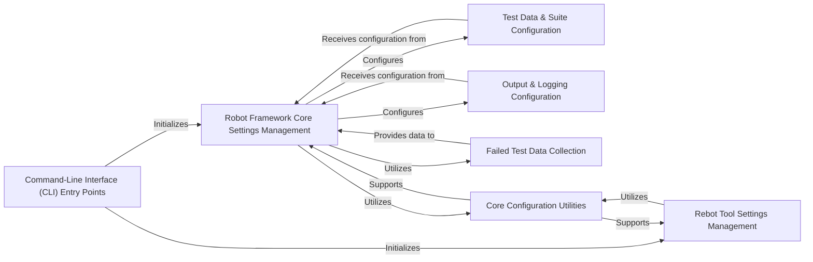

## Component Details

This subsystem serves as the primary interface for users to interact with Robot Framework, handling command-line input, managing all framework-level and execution-specific settings, and orchestrating the initial setup of the test automation flow. It acts as the control center, translating user commands and configurations into the necessary internal processes.

### Command-Line Interface (CLI) Entry Points

This component serves as the primary user-facing interface for all Robot Framework tools. It is responsible for parsing command-line arguments provided by the user and initiating the appropriate execution flow for specific tools such as `robot` (for test execution), `rebot` (for post-processing outputs), `libdoc` (for library documentation), and `testdoc` (for test documentation).

**Related Classes/Methods**:

- `RobotFramework:main` (0:0)

- <a href="https://github.com/robotframework/robotframework/blob/master/src/robot/rebot.py#L345-L361" target="_blank" rel="noopener noreferrer">`Rebot:main` (345:361)</a>

- `LibDoc:main` (0:0)

- `TestDoc:main` (0:0)

### Robot Framework Core Settings Management

This central component is responsible for parsing, validating, storing, and providing all configuration settings relevant to the primary Robot Framework test execution. It consolidates user-defined options (from command-line arguments, configuration files, etc.) and makes them accessible to other parts of the framework, covering aspects like input sources, output paths, logging levels, and test selection criteria.

**Related Classes/Methods**:

- `RobotSettings` (0:0)

### Rebot Tool Settings Management

A specialized component dedicated to managing configuration settings specifically for the `rebot` tool. It handles options related to post-processing Robot Framework XML output files, such as generating reports and logs, customizing their titles and appearance, and merging multiple output files.

**Related Classes/Methods**:

- `RebotSettings` (0:0)

### Test Data & Suite Configuration

This component is responsible for interpreting and applying user-defined configurations related to test data sources and the structure of the test suite. It includes building the executable test suite from various inputs (e.g., test files, directories) and applying pre-run modifications such as including/excluding tests or modifying the test model based on user settings.

**Related Classes/Methods**:

- `TestSuiteBuilder` (0:0)

- <a href="https://github.com/robotframework/robotframework/blob/master/atest/robot/cli/model_modifiers/ModelModifier.py#L5-L80" target="_blank" rel="noopener noreferrer">`ModelModifier` (5:80)</a>

### Output & Logging Configuration

Manages the configuration and generation of various output artifacts from a test run, including detailed log files, human-readable reports, and xUnit-compatible outputs. It ensures that test results are captured, formatted, and persisted according to user preferences for analysis and integration.

**Related Classes/Methods**:

- `ResultWriter` (0:0)

- <a href="https://github.com/robotframework/robotframework/blob/master/src/robot/output/pyloggingconf.py#L0-L0" target="_blank" rel="noopener noreferrer">`pyloggingconf` (0:0)</a>

- <a href="https://github.com/robotframework/robotframework/blob/master/src/robot/api/logger.py#L0-L0" target="_blank" rel="noopener noreferrer">`logger` (0:0)</a>

### Failed Test Data Collection

This component is responsible for identifying and gathering information about tests or suites that failed in a previous Robot Framework execution. The collected data is then utilized by the `Robot Framework Core Settings Management` component to support features like `--rerunfailed`, enabling efficient re-execution of only problematic tests.

**Related Classes/Methods**:

- `gather_failed_tests` (0:0)

- `gather_failed_suites` (0:0)

### Core Configuration Utilities

Provides a set of low-level, general-purpose utility functions that support various aspects of configuration processing, data manipulation, and text handling across the `User Interface & Configuration` subsystem. These include functions for path manipulation, escaping special characters, and managing text formatting limits.

**Related Classes/Methods**:

- <a href="https://github.com/robotframework/robotframework/blob/master/src/robot/utils/escaping.py#L0-L0" target="_blank" rel="noopener noreferrer">`escaping` (0:0)</a>

- <a href="https://github.com/robotframework/robotframework/blob/master/src/robot/utils/markuputils.py#L0-L0" target="_blank" rel="noopener noreferrer">`markuputils` (0:0)</a>

- <a href="https://github.com/robotframework/robotframework/blob/master/src/robot/utils/robotpath.py#L0-L0" target="_blank" rel="noopener noreferrer">`robotpath` (0:0)</a>

- <a href="https://github.com/robotframework/robotframework/blob/master/src/robot/utils/text.py#L0-L0" target="_blank" rel="noopener noreferrer">`text` (0:0)</a>

### [FAQ](https://github.com/CodeBoarding/GeneratedOnBoardings/tree/main?tab=readme-ov-file#faq)