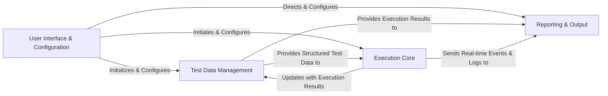

## Component Details

The architecture of Robot Framework can be effectively summarized by four fundamental components, each representing a distinct phase or responsibility within the test automation lifecycle. These components are chosen for their critical roles in processing, executing, and reporting, and for their ability to encapsulate related functionalities identified in the CFG and Source Analysis.

### User Interface & Configuration

This component serves as the primary entry point for all Robot Framework functionalities. It is responsible for parsing command-line arguments, loading and managing all framework-level and execution-specific settings, and orchestrating the overall test automation flow based on user input. It acts as the control center, initiating and configuring subsequent processes.

**Related Classes/Methods**:

- <a href="https://github.com/robotframework/robotframework/blob/master/src/robot/run.py#L450-L499" target="_blank" rel="noopener noreferrer">`src.robot.run.RobotFramework:main` (450:499)</a>

- <a href="https://github.com/robotframework/robotframework/blob/master/src/robot/rebot.py#L345-L361" target="_blank" rel="noopener noreferrer">`src.robot.rebot.Rebot:main` (345:361)</a>

- <a href="https://github.com/robotframework/robotframework/blob/master/src/robot/libdoc.py#L184-L221" target="_blank" rel="noopener noreferrer">`src.robot.libdoc.LibDoc:main` (184:221)</a>

- <a href="https://github.com/robotframework/robotframework/blob/master/src/robot/testdoc.py#L118-L122" target="_blank" rel="noopener noreferrer">`src.robot.testdoc.TestDoc:main` (118:122)</a>

- <a href="https://github.com/robotframework/robotframework/blob/master/src/robot/conf/settings.py#L493-L714" target="_blank" rel="noopener noreferrer">`src.robot.conf.settings.RobotSettings` (493:714)</a>

- <a href="https://github.com/robotframework/robotframework/blob/master/src/robot/conf/settings.py#L717-L799" target="_blank" rel="noopener noreferrer">`src.robot.conf.settings.RebotSettings` (717:799)</a>

### Test Data Management

This component is the backbone for representing and processing test information. It encompasses the parsing engine that converts raw Robot Framework test files (e.g., `.robot`, `.resource`) into an internal, structured object model (suites, test cases, keywords). It also defines and holds the detailed results of test execution, making it the central data structure that flows through the entire framework.

**Related Classes/Methods**:

- <a href="https://github.com/robotframework/robotframework/blob/master/src/robot/model/testsuite.py#L38-L482" target="_blank" rel="noopener noreferrer">`src.robot.model.testsuite.TestSuite` (38:482)</a>

- <a href="https://github.com/robotframework/robotframework/blob/master/src/robot/model/testcase.py#L36-L218" target="_blank" rel="noopener noreferrer">`src.robot.model.testcase.TestCase` (36:218)</a>

- <a href="https://github.com/robotframework/robotframework/blob/master/src/robot/model/keyword.py#L25-L73" target="_blank" rel="noopener noreferrer">`src.robot.model.keyword.Keyword` (25:73)</a>

- <a href="https://github.com/robotframework/robotframework/blob/master/src/robot/result/model.py#L1051-L1317" target="_blank" rel="noopener noreferrer">`src.robot.result.model.TestSuite` (1051:1317)</a>

- <a href="https://github.com/robotframework/robotframework/blob/master/src/robot/result/model.py#L1002-L1048" target="_blank" rel="noopener noreferrer">`src.robot.result.model.TestCase` (1002:1048)</a>

- <a href="https://github.com/robotframework/robotframework/blob/master/src/robot/result/model.py#L788-L999" target="_blank" rel="noopener noreferrer">`src.robot.result.model.Keyword` (788:999)</a>

- <a href="https://github.com/robotframework/robotframework/blob/master/src/robot/parsing/parser/parser.py#L26-L59" target="_blank" rel="noopener noreferrer">`src.robot.parsing.parser.parser:get_model` (26:59)</a>

- <a href="https://github.com/robotframework/robotframework/blob/master/src/robot/parsing/lexer/lexer.py#L96-L208" target="_blank" rel="noopener noreferrer">`src.robot.parsing.lexer.lexer.Lexer` (96:208)</a>

- <a href="https://github.com/robotframework/robotframework/blob/master/src/robot/parsing/suitestructure.py#L115-L185" target="_blank" rel="noopener noreferrer">`src.robot.parsing.suitestructure.SuiteStructureBuilder` (115:185)</a>

### Execution Core

This is the heart of Robot Framework, responsible for the actual running of test suites, individual test cases, and keywords. It manages the execution flow, handles argument passing, resolves variables dynamically, and dispatches calls to various test libraries (BuiltIn, Collections, OS, etc.) to perform the defined actions. It tracks the real-time status and outcomes of each step.

**Related Classes/Methods**:

- <a href="https://github.com/robotframework/robotframework/blob/master/src/robot/running/suiterunner.py#L35-L298" target="_blank" rel="noopener noreferrer">`src.robot.running.suiterunner.SuiteRunner` (35:298)</a>

- <a href="https://github.com/robotframework/robotframework/blob/master/src/robot/running/bodyrunner.py#L39-L72" target="_blank" rel="noopener noreferrer">`src.robot.running.bodyrunner.BodyRunner` (39:72)</a>

- <a href="https://github.com/robotframework/robotframework/blob/master/src/robot/running/namespace.py#L33-L228" target="_blank" rel="noopener noreferrer">`src.robot.running.namespace.Namespace` (33:228)</a>

- <a href="https://github.com/robotframework/robotframework/blob/master/src/robot/variables/scopes.py#L28-L173" target="_blank" rel="noopener noreferrer">`src.robot.variables.scopes.VariableScopes` (28:173)</a>

- <a href="https://github.com/robotframework/robotframework/blob/master/src/robot/variables/replacer.py#L26-L210" target="_blank" rel="noopener noreferrer">`src.robot.variables.replacer.VariableReplacer` (26:210)</a>

- <a href="https://github.com/robotframework/robotframework/blob/master/src/robot/variables/search.py#L22-L30" target="_blank" rel="noopener noreferrer">`src.robot.variables.search:search_variable` (22:30)</a>

- <a href="https://github.com/robotframework/robotframework/blob/master/src/robot/libraries/BuiltIn.py#L4091-L4369" target="_blank" rel="noopener noreferrer">`src.robot.libraries.BuiltIn.BuiltIn` (4091:4369)</a>

- <a href="https://github.com/robotframework/robotframework/blob/master/src/robot/libraries/Collections.py#L987-L1261" target="_blank" rel="noopener noreferrer">`src.robot.libraries.Collections.Collections` (987:1261)</a>

- <a href="https://github.com/robotframework/robotframework/blob/master/src/robot/libraries/OperatingSystem.py#L39-L1449" target="_blank" rel="noopener noreferrer">`src.robot.libraries.OperatingSystem.OperatingSystem` (39:1449)</a>

- <a href="https://github.com/robotframework/robotframework/blob/master/src/robot/libraries/Process.py#L35-L906" target="_blank" rel="noopener noreferrer">`src.robot.libraries.Process.Process` (35:906)</a>

- <a href="https://github.com/robotframework/robotframework/blob/master/src/robot/libraries/XML.py#L45-L1458" target="_blank" rel="noopener noreferrer">`src.robot.libraries.XML.XML` (45:1458)</a>

### Reporting & Output

This component handles all forms of output generated by Robot Framework. It includes real-time logging to the console and various log files (XML, plain text), generating comprehensive human-readable HTML logs and reports from the execution result model, and providing an extensible API for external listeners to consume execution events. It also manages the post-processing and combination of raw XML output files (Rebot functionality).

**Related Classes/Methods**:

- <a href="https://github.com/robotframework/robotframework/blob/master/src/robot/output/logger.py#L42-L460" target="_blank" rel="noopener noreferrer">`src.robot.output.logger.Logger` (42:460)</a>

- <a href="https://github.com/robotframework/robotframework/blob/master/src/robot/reporting/resultwriter.py#L26-L87" target="_blank" rel="noopener noreferrer">`src.robot.reporting.resultwriter.ResultWriter` (26:87)</a>

- <a href="https://github.com/robotframework/robotframework/blob/master/src/robot/reporting/jsmodelbuilders.py#L46-L73" target="_blank" rel="noopener noreferrer">`src.robot.reporting.jsmodelbuilders.JsModelBuilder` (46:73)</a>

- <a href="https://github.com/robotframework/robotframework/blob/master/src/robot/rebot.py#L345-L361" target="_blank" rel="noopener noreferrer">`src.robot.rebot.Rebot:main` (345:361)</a>

- <a href="https://github.com/robotframework/robotframework/blob/master/src/robot/result/resultbuilder.py#L103-L204" target="_blank" rel="noopener noreferrer">`src.robot.result.resultbuilder.ExecutionResultBuilder` (103:204)</a>

- <a href="https://github.com/robotframework/robotframework/blob/master/src/robot/output/listeners.py#L31-L95" target="_blank" rel="noopener noreferrer">`src.robot.output.listeners.Listeners` (31:95)</a>

- <a href="https://github.com/robotframework/robotframework/blob/master/src/robot/output/listeners.py#L263-L586" target="_blank" rel="noopener noreferrer">`src.robot.output.listeners.ListenerV2Facade` (263:586)</a>

- <a href="https://github.com/robotframework/robotframework/blob/master/src/robot/output/listeners.py#L162-L260" target="_blank" rel="noopener noreferrer">`src.robot.output.listeners.ListenerV3Facade` (162:260)</a>

### [FAQ](https://github.com/CodeBoarding/GeneratedOnBoardings/tree/main?tab=readme-ov-file#faq)